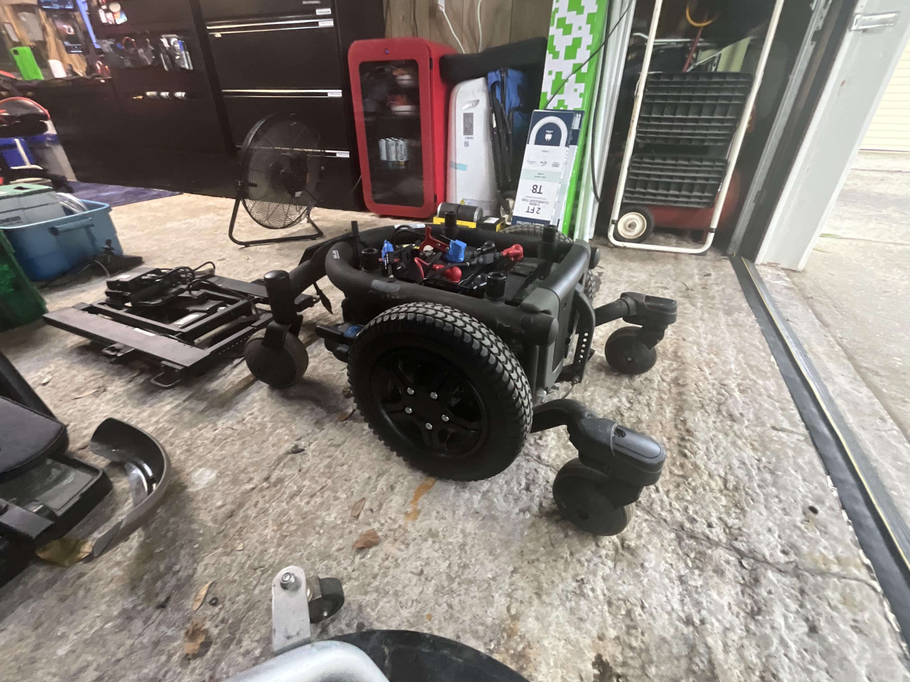

# W.R.A.I.T.H.

Wheeled Robotic Autonomous Tactical Hauler — a custom robotics platform built from a Quantum 600 powered-wheelchair base.

## Current integration

*WRAITH powered-wheelchair base during active mechanical and electronics integration.*

## Hardware status

W.R.A.I.T.H. is an active custom robotics build based on a Quantum 600 powered-wheelchair platform.

### Current build hardware

| Subsystem | Hardware | Status |
|---|---|---|
| Mobile base | Quantum 600 powered-wheelchair base | In active mechanical and electronics integration |
| Drive | Dual ElectroCraft motors | Current build hardware |
| Motor control | Basicmicro MCP266 motor controller | Current build hardware |
| Teleoperation | RC control system | Current build hardware |
| Vision | Camera and YOLO vision testing | Under active development |

### Planned integration

| Subsystem | Planned direction |
|---|---|
| Main computer | Dell OptiPlex i5-13500T with 64 GB RAM |
| Perception | 360° camera mast and LiDAR |
| Autonomy | Navigation and autonomous-operation capabilities |
| Manipulation | Robotic manipulator arm |
| Power resilience | Deployable solar capability |

This is an evolving engineering platform. Planned items are not represented as installed, tested, or complete.

This repository documents the build as it exists; it is an active engineering project, not a finished product.

## Outdoor operation preview

[Watch the short WRAITH outdoor operation preview.](wraith-field-test-preview.mp4)

*User-provided footage showing RC-operated outdoor movement with the current mounted laptop/camera setup.*
